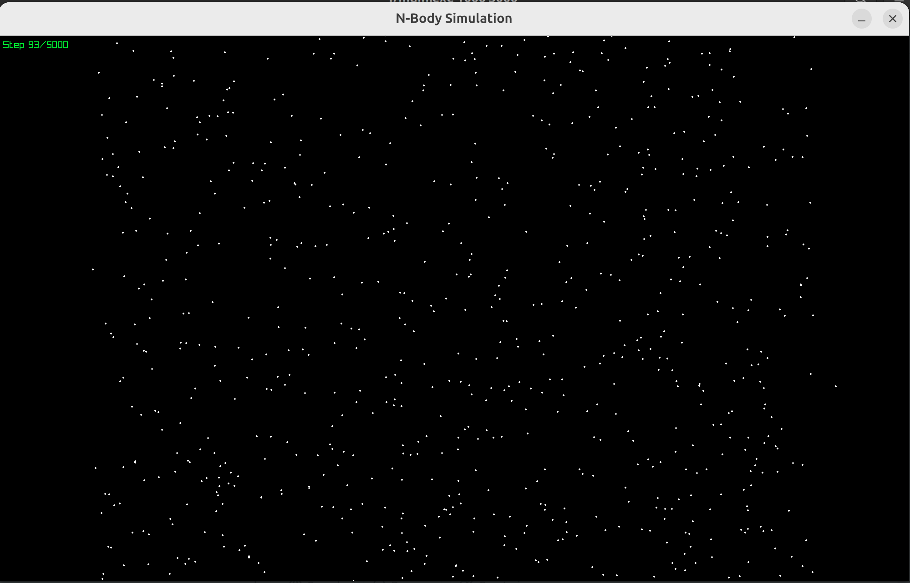

# 598APE-HW3

This repository contains code for homework 3 of 598APE.

This assignment is relatively simple in comparison to HW1 and HW2 to ensure you have enough time to work on the course project.

In particular, this repository is an implementation of an n-body simulator.

To compile the program run:
```bash
make -j
```

To clean existing build artifacts run:
```bash
make clean
```

This program assumes the following are installed on your machine:
* A working C compiler (g++ is assumed in the Makefile)
* make

The nbody program is a classic physics simulation whose exact results are unable to be solved for exactly through integration.

Here we implement a simple time evolution where each iteration advances the simulation one unit of time, according to Newton's law of gravitation.

Once compiled, one can call the nbody program as follows, where nplanets is the number of randomly generated planets for the simulation, and timesteps denotes how long to run the simulation for:
```bash
./main.exe <nplanets> <timesteps>
```

In particular, consider speeding up simple run like the following (which runs ~6 seconds on my local laptop under the default setup):
```bash
./main.exe 1000 5000
```

Exact bitwise reproducibility is not required, but approximate correctness (within a reasonable region of the final location).


# Progress

## 0. Baseline
Total time to run simulation 11.407342 seconds, final location 4221.875063 -2827.830995

## 1. Multithread + Loop Unrolling
Total time to run simulation 2.375242 seconds, final location 4221.875063 -2827.830995

## 3. Double Buffering + Inline Function
Total time to run simulation 2.217423 seconds, final location 4220.770400 -2827.323041

# Visualization
Use ```raylib``` to visualize the simulation.

## Build ```raylib```
On ubuntu, install the following dependencies,

```shell
sudo apt install build-essential git
sudo apt install libasound2-dev libx11-dev libxrandr-dev libxi-dev libgl1-mesa-dev libglu1-mesa-dev libxcursor-dev libxinerama-dev libwayland-dev libxkbcommon-dev
```

Clone source code,

```shell
git clone https://github.com/raysan5/raylib.git
cd raylib
```

Build raylib,

```shell
mkdir build
cd build
cmake ..
make -j4
```

Install raylib system-wide (this is optional!!!),

```shell
sudo make install
```

A screenshot of the visualised simulation.


